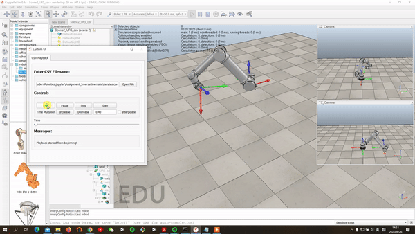
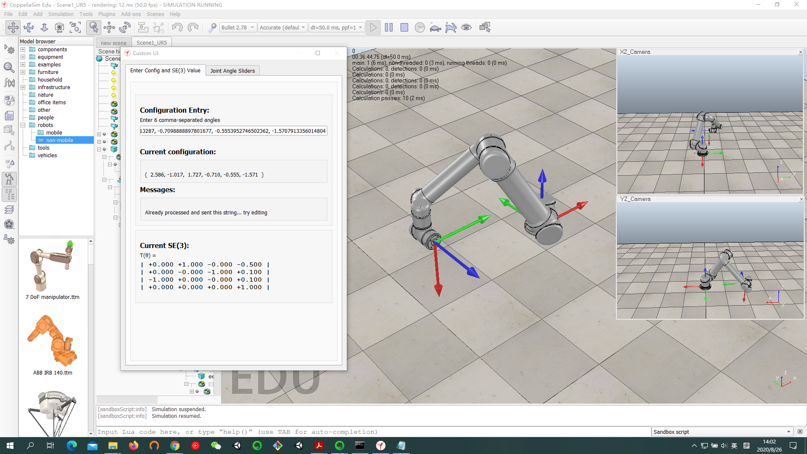

# Modern Robotics Course 2 (Robot Kinematics) Project

Instructor: [Kevin M. Lynch](https://robotics.northwestern.edu/people/profiles/faculty/lynch-kevin.html)

## Introduction

This repository containts my work for the course project of the Specialization [Modern Robotics:Mechanics, Planning and Control Specialization](https://www.coursera.org/specializations/modernrobotics)

In this programming assignment, I have modified the {\tt IKinBody}IKinBody function in the [modern_robotic library](https://github.com/NxRLab/ModernRobotics) to report the intermediate iterates of the Newton-Raphson inverse kinematics. I have applied my new function to solve the inverse kinematics of the UR5 industrial robot, and I have visualized the convergence of the iterations using the [CoppeliaSim robot simulator](https://www.coppeliarobotics.com/).

The goals of this programming assignment are three-fold:
	1. Increase the mastery of the MR library code.
	2. Increase the comfort working with the CoppeliaSim simulator.
	3. Solidify the understanding of numerical inverse kinematics.

## Requirements

1. The outputs of the code will logged into the "log.txt" file, which shows necessary informations(iteration step number, joint angles vector, SE(3)end-effector configuration, error Twist in end-effector body frame, angular error magnitude, linear error magnitude) at each step.
2. A text file called "iterates.cvs" will be created by the program, where each row of the text file consists of the comma separated joint values for that iterate.
3. The initial guess $\theta^0$ is chosen, so that the numerical inverse kinematics converges after 3-5 Newton-Raphson steps. 

## Result

The convergence process of UR5 Robotarm from initial guess to the desired end-effector configuration

$$
 T_{sd}=
 \left[
 \begin{matrix}
   0 & 1 & 0 & -0.5 \\
   0 & 0 & -1 & 0.1\\
   -1 & 0 & 0 & 0.1\\
   0 & 0 & 0 & 1
  \end{matrix}
  \right]
$$

is demonstrated as follows

